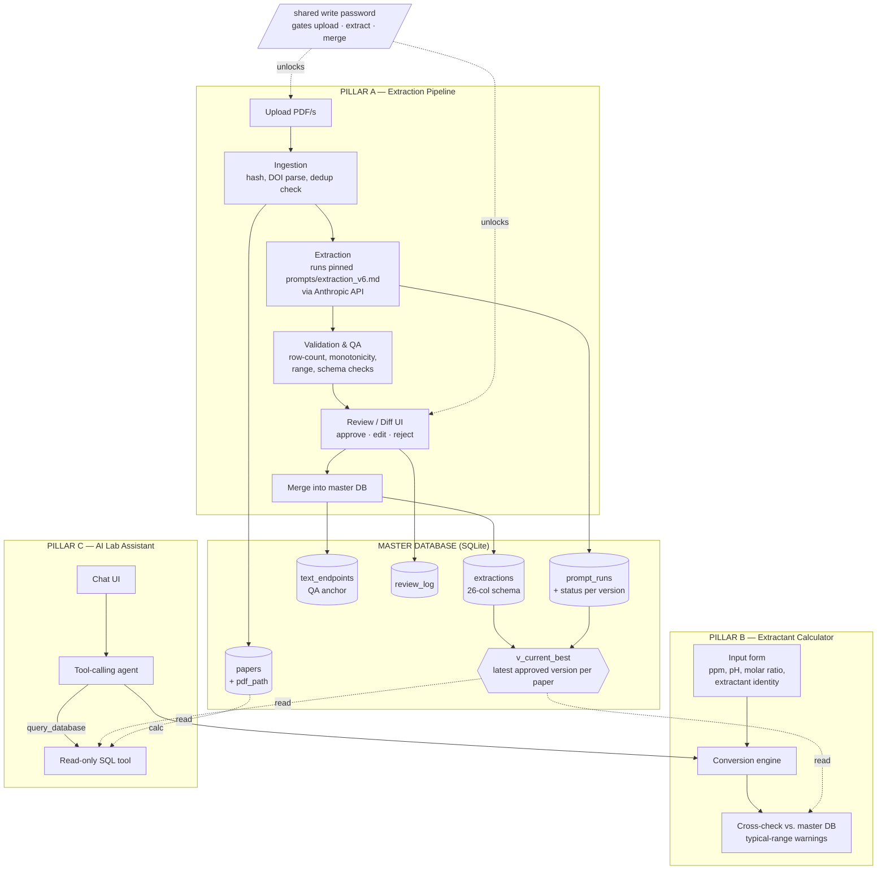

# REE Extraction Dashboard

A development plan for a web app that turns rare-earth-element (REE) solvent-extraction papers into a queryable database, computes extraction parameters, and answers questions against the accumulated data.

> **Status:** This document is the original *design plan*. The application has since been built and has moved past the plan in places — most notably the pinned extraction prompt is now **`extraction_v6`** (the plan was written when `extraction_v5.1` was current; the prompt evolved v5.1 → v5.2 → v6, see `prompts/CHANGELOG.md`). Where this plan names `extraction_v5.1` as the *current pinned default*, read `extraction_v6`; the historical discussion of the v5 → v5.1 evolution is kept for design rationale. Section numbers here (`README §6`, etc.) are referenced throughout the code and the [CLAUDE.md](CLAUDE.md) guide. Build order is in [Section 10](#10-milestones--build-order).

---

## 1. Project overview

The **REE Extraction Dashboard** is a web tool for building and using a structured database of rare-earth solvent-extraction experiments mined from journal papers. The owner (holding a shared write password) uploads PDFs; the dashboard runs a pinned, versioned **extraction prompt** (currently `extraction_v6.md`) against each paper's primary figure (typically *% Extraction vs. pH* or *log D vs. [extractant]*) to produce one row-per-data-point spreadsheet conforming to a fixed **26-column schema**, reviews and de-duplicates the result, and merges it into a master database. On top of that database sit two consumers, both on an **open, no-login read path** so anyone reaching the site can use them: an **extractant calculator** that does the ppm↔mM / molar-ratio / concentration math an experimentalist needs at the bench, and an **AI lab assistant** that answers natural-language questions by querying the database (never by inventing numbers). Writing is gated by one shared password and assumes a single writer at a time; reading is open; the master DB is built to grow to hundreds of papers without re-architecture.

---

## 2. Architecture diagram



**Data flow in one line:** `upload → ingest/dedup → extract (versioned prompt) → validate/QA → human review → merge → {query by assistant, sanity-check by calculator}`.

The master DB is the hub. Pillar A is the only writer. Pillars B and C are read-only consumers that query through the **`v_current_best` view** (the latest *approved* prompt version per paper), never the raw `extractions` table — so a new prompt version coexists with old data without any migration. This separation is deliberate: B and C can never corrupt the dataset, and the assistant's worst failure is a bad *read*, not a bad *write*.

**Access model:** all read paths (browse DB, calculator, assistant) are **fully open — no auth**. All write paths (upload, run extraction, approve/merge) route through one gate, `auth.require_write_access()`, controlled by the `REQUIRE_PASSWORD` flag in `.env` (off for the current local demo; a single shared password when on). See [Section 3](#access-control-flag-gated-shared-write-password) — this is a convenience gate, not real authentication.

---

## 3. Tech stack decision

The user wants Python end-to-end where it genuinely fits. It does. Every pillar is either I/O against the Anthropic API, dataframe math, or SQL — all of which are first-class in Python, and none of which benefit from a JS frontend.

### Web framework: **Streamlit** ✅

| Need | Streamlit | FastAPI + JS frontend |
| --- | --- | --- |
| File-upload UX | `st.file_uploader` built in, multi-file native | Build upload endpoint + frontend dropzone yourself |
| Review/diff tables with inline edit | `st.data_editor` gives editable grids free | Build a data grid component (AG-Grid/React) |
| Chat interface | `st.chat_message` / `st.chat_input` native | Build chat UI + streaming SSE plumbing |
| Long-running extraction jobs | Weak spot — see mitigation below | Native (background tasks, websockets) |
| Build effort for a single researcher | **Days** | Weeks |
| Multi-user / public deploy | Not its strength | Native |

**Decision: Streamlit.** The hard parts of this tool are *file upload, editable review grids, and chat* — the exact three things Streamlit makes trivial and a custom frontend makes expensive. The app is open-read / single-shared-password-write (below), so it has no per-user accounts, sessions, or roles to manage — exactly the kind of app Streamlit suits. The one real weakness, long-running extraction jobs (a paper can take 30–120 s through the API), is mitigated, not eliminated:

- Run extraction **per-PDF as a discrete job** and persist each result to disk (`data/staging/`) the moment it finishes, so a rerun/refresh never loses completed work.
- Use `st.status` / `st.progress` to stream per-paper progress.
- For batch jobs, process sequentially with a visible queue rather than holding everything in one request. If batch sizes ever exceed ~20 papers and the UX feels bad, *then* extract the extraction worker into a small background process (a `subprocess` or a lightweight job runner) that writes to `staging/` while Streamlit polls — but do not build that until the pain is real.

### Storage backend: **SQLite** ✅

| Criterion | SQLite | Postgres | File-based (Parquet/Excel) |
| --- | --- | --- | --- |
| Scale (tens→low hundreds of papers, ~10³–10⁴ rows) | Ample | Overkill | Ample |
| Querying for assistant (text-to-SQL) | Native SQL | Native SQL | Need pandas glue / DuckDB |
| Concurrent writes during review/merge | Single-writer, fine here | Strong | Poor (whole-file rewrite, corruption risk) |
| Ops burden | Zero (one file) | Server to run/back up | Zero |
| Dedup constraints (UNIQUE on DOI/hash) | Native | Native | Manual |
| Audit/review tables + "current best" view | Native | Native | Awkward |

**Decision: SQLite.** The dataset is small, single-writer (only the password-holder mutates it), and benefits enormously from real SQL: the assistant in Pillar C is text-to-SQL, the dedup logic in Pillar A is `UNIQUE` constraints, the prompt-version coexistence is a `VIEW` (`v_current_best`), and the audit trail is a `review_log` table. Because access control is a single shared password rather than per-user roles (below), there is **no requirement for database-level users or row-level security** — which removes the only reason this project might have reached for Postgres. A pile of Excel/Parquet files gives you neither constraints nor cheap querying and makes the review/merge step a whole-file rewrite. SQLite is the simplest thing that supports both querying and growth.

> The 26-column schema lives **inside** SQLite as the `extractions` table. Per-paper spreadsheets (XLSX) are still produced as **export artifacts** for the researcher's own use and as the human-reviewable diff unit — but they are derived from the DB, not the source of truth. If you later want columnar analytics, point **DuckDB** at the same SQLite file or export to Parquet; you do not need to change the primary store to get there.

### Access control: flag-gated shared write password

This app has **no user accounts and no roles.** Access is split by *action*, not by *identity*, and the write gate is itself behind a **single config flag** so the same code serves both the current local-only demo and an eventual shared deployment:

- **Current run mode (local demo).** `REQUIRE_PASSWORD=false` in `.env`. The app runs as `streamlit run app.py` on `localhost`, single machine, no network exposure, for the researcher's own use. Every write action (upload, extraction, approve/commit-to-master-DB) is simply available — no prompt. This is the present reality, **not a permanent decision**.
- **Future shared mode (one config flip).** Set `REQUIRE_PASSWORD=true` and `WRITE_PASSWORD=<secret>` in `.env`. Read paths (browse the master DB, run the calculator, chat with the assistant) stay completely open; every *mutating* action is gated behind one shared password. The same single password unlocks upload, extraction, and approve/commit — there is **no separate "uploader" vs. "approver" credential**. Authenticating once unlocks the entire write-side UI for that browser session.
- **One gate function, not scattered checks.** All write actions route through `auth.require_write_access()` (in [auth.py](auth.py)). When `REQUIRE_PASSWORD=false` it returns immediately; when `true` it enforces the shared-password check (setting `st.session_state["write_unlocked"] = True` on success). Going from demo to shared use is a flag flip, not a rebuild.
- **Everyone who authenticates is indistinguishable.** There is therefore no `reviewer` / `approved_by` column anywhere in the schema — even with the gate on, attributing *who* did something is impossible, and a column implying otherwise would be misleading. A `reviewed_at` **timestamp** is kept (it's meaningful); a reviewer **identity** is not.

> ⚠️ **Security tradeoff, stated plainly:** even with `REQUIRE_PASSWORD=true`, this is a *convenience gate*, not an authentication system. A single shared secret with no accounts, lockout, rate-limiting, or per-user audit is **not** appropriate for sensitive data or an untrusted public deployment. Wider deployment to the UCI chem lab — with real lab-membership enforcement and PDF copyright clearance ([Section 11](#11-open-questions--decisions-the-user-still-needs-to-make)) — is a separate, later effort, and would likely mean a re-architecture (proper auth, per-user identity, possibly the FastAPI path), not a config tweak.

---

## 4. Repository structure

```
rare-earth-extraction/
├── README.md                      ← this plan
├── app.py                         ← Streamlit entrypoint (page router only)
├── auth.py                        ← shared-password write gate (require_write_unlock())
├── .env.example                   ← documents WRITE_PASSWORD + ANTHROPIC_API_KEY (no secrets)
│
├── prompts/                       ← VERSIONED extraction prompts (the black box)
│   ├── extraction_v5.md           ← prior production prompt (copy your existing one here)
│   ├── extraction_v5.1.md         ← v5 + additive text-endpoints output (see Section 6)
│   ├── extraction_v4.md           ← retained for reproducibility, never deleted
│   └── CHANGELOG.md               ← what changed between prompt versions and why
│
├── ingestion/
│   ├── __init__.py
│   ├── upload.py                  ← accept PDFs, persist to data/incoming/<sha256>.pdf
│   ├── pdf_inspect.py             ← raster-vs-vector detection, page/figure triage
│   ├── doi.py                     ← parse DOI from PDF metadata/text
│   └── dedup.py                   ← content hash + DOI lookup against papers table
│
├── extraction/
│   ├── __init__.py
│   ├── runner.py                  ← orchestrates one extraction run end-to-end
│   ├── prompt_loader.py           ← loads a pinned prompt version, returns (text, version)
│   ├── anthropic_client.py        ← thin wrapper over the Anthropic API
│   └── parse_output.py            ← model output → (26-col DataFrame, text_endpoints rows)
│
├── validation/
│   ├── __init__.py
│   ├── schema.py                  ← the 26-column contract (names, dtypes, units)
│   ├── vocab.py                   ← known-values lists for Extractant type / mixing method / …
│   ├── checks.py                  ← row-count, monotonicity, range, vocab, conformance checks
│   └── report.py                  ← QAReport object the review UI renders
│
├── database/
│   ├── __init__.py
│   ├── schema.sql                 ← CREATE TABLE + CREATE VIEW statements (see Section 5)
│   ├── connection.py              ← get_conn() (write) + get_readonly_conn() with sane pragmas
│   ├── migrations/                ← numbered .sql files; never edit a shipped one
│   │   └── 0001_init.sql
│   ├── papers_repo.py             ← CRUD for papers table (incl. pdf_path)
│   ├── extractions_repo.py        ← append extractions + text_endpoints; query via v_current_best
│   └── review_repo.py             ← review_log + prompt_runs status writes
│
├── calculator/
│   ├── __init__.py
│   ├── atomic_mass.py             ← REE atomic-mass table (single source of truth)
│   ├── conversions.py             ← ppm↔mM, molar ratio, volume (pure functions)
│   └── sanity.py                  ← pulls typical ranges from master DB for warnings
│
├── assistant/
│   ├── __init__.py
│   ├── agent.py                   ← tool-calling loop
│   ├── tools.py                   ← query_database, calculator tools (read-only)
│   ├── system_prompt.md           ← scope + anti-hallucination guardrails
│   └── sql_guard.py               ← validates/limits generated SQL (SELECT-only)
│
├── pages/                         ← Streamlit multipage UI
│   ├── 1_Upload_and_Extract.py    ← Pillar A
│   ├── 2_Review_and_Merge.py      ← Pillar A review/diff
│   ├── 3_Calculator.py            ← Pillar B
│   └── 4_Lab_Assistant.py         ← Pillar C
│
├── data/                          ← gitignored; runtime artifacts
│   ├── incoming/                  ← persisted source PDFs, named <sha256>.pdf (re-extraction)
│   ├── staging/                   ← per-paper extracted XLSX awaiting review
│   ├── exports/                   ← approved per-paper XLSX exports
│   └── master.db                  ← the SQLite master database
│
└── tests/
    ├── fixtures/                  ← a few real test papers (see Section 6) + golden outputs
    ├── test_conversions.py        ← Pillar B math (pure, fast, must be exhaustive)
    ├── test_checks.py             ← validation rules against known-bad extractions
    ├── test_dedup.py
    ├── test_parse_output.py
    └── test_sql_guard.py
```

Design notes:
- **`prompts/` is the seam.** Nothing in `extraction/` hardcodes prompt text. `prompt_loader.py` loads `extraction_vN.md` and returns the version string, which is recorded on every run. Improving the prompt = drop in `extraction_v6.md` and bump the pinned default. No pipeline code changes.
- **`auth.py` is the only write gate.** Every page that mutates state calls `require_write_unlock()` first; read-only pages never do. The password is read from `.env`, compared once, and the unlocked state lives in `st.session_state`.
- **`validation/` is independent of the API.** It operates on a DataFrame (plus the `text_endpoints` rows), so it is fully unit-testable against golden files without spending tokens.
- **`calculator/conversions.py` is pure functions** — no DB, no I/O — so Pillar C can reuse it as a tool and the tests can be exhaustive and instant.
- **`v_current_best` is the read contract.** Pillars B and C never touch raw `extractions`; they query the view, so prompt-version coexistence ([Section 5](#5-database-schema)) is invisible to them.

---

## 5. Database schema

The `extractions` table *is* the 26-column schema, with surrogate keys and provenance columns bolted on. Original column names are preserved (as quoted identifiers) so the table reads identically to the spreadsheet the prompt already produces. Two supporting tables (`papers`, `prompt_runs`) carry provenance and dedup; `text_endpoints` carries the QA anchor; `review_log` carries the edit audit trail; and a **view** (`v_current_best`) resolves prompt-version coexistence at query time so consumers always see the latest approved version per paper.

```sql
-- database/schema.sql

PRAGMA foreign_keys = ON;
PRAGMA journal_mode = WAL;   -- safer concurrent read during a write

-- ── papers: one row per source paper; the dedup + provenance anchor ──────────
CREATE TABLE papers (
    paper_id        INTEGER PRIMARY KEY AUTOINCREMENT,
    reference_no    TEXT,                 -- "Reference No." from the schema
    doi             TEXT UNIQUE,          -- canonicalised, lowercase; dedup key #1
    title           TEXT,
    content_sha256  TEXT UNIQUE NOT NULL, -- hash of PDF bytes; dedup key #2
    original_filename TEXT,
    pdf_path        TEXT NOT NULL,        -- data/incoming/<sha256>.pdf; PDFs are persisted
    figure_type     TEXT,                 -- 'pct_E_vs_pH' | 'logD_vs_conc' | 'other'
    is_raster_figure INTEGER,             -- 1/0/NULL; set by pdf_inspect
    uploaded_at     TEXT NOT NULL DEFAULT (datetime('now'))
    -- NOTE: no paper-level 'status'; review state lives per-version on prompt_runs.status
    --       so re-extraction under a new prompt version doesn't clobber prior approvals.
);

-- ── prompt_runs: one row per extraction ATTEMPT; (paper_id, prompt_version) is
--    the coexistence key — re-running under a new version adds a row, never replaces ─
CREATE TABLE prompt_runs (
    prompt_run_id   INTEGER PRIMARY KEY AUTOINCREMENT,
    paper_id        INTEGER NOT NULL REFERENCES papers(paper_id),
    prompt_version  TEXT NOT NULL,        -- e.g. 'extraction_v5.1'
    prompt_sha256   TEXT NOT NULL,        -- hash of the prompt file actually used
    model           TEXT NOT NULL,        -- e.g. 'claude-opus-4-8'
    status          TEXT NOT NULL DEFAULT 'pending'
                    CHECK (status IN ('pending','approved','rejected')),
    run_timestamp   TEXT NOT NULL DEFAULT (datetime('now')),
    reviewed_at     TEXT,                 -- when approved/rejected; NO reviewer identity (shared pw)
    n_rows_returned INTEGER,
    qa_passed       INTEGER,              -- 1/0 overall QA verdict
    qa_report_json  TEXT,                 -- serialized QAReport (warnings, flags)
    raw_response    TEXT                  -- full model output, for audit/replay
);

-- one approved run per (paper, prompt_version): a paper can be re-approved under a NEW
-- version, but not approved twice under the SAME version
CREATE UNIQUE INDEX idx_one_approved_per_version
    ON prompt_runs(paper_id, prompt_version) WHERE status = 'approved';

-- ── extractions: THE 26-COLUMN SCHEMA, one row per digitized data point per element ──
CREATE TABLE extractions (
    extraction_id   INTEGER PRIMARY KEY AUTOINCREMENT,
    paper_id        INTEGER NOT NULL REFERENCES papers(paper_id),
    prompt_run_id   INTEGER NOT NULL REFERENCES prompt_runs(prompt_run_id),

    "Reference No."                       TEXT,
    "DOI"                                 TEXT,
    "Treatment"                           TEXT,
    "Sources"                             TEXT,
    "Material Process"                    TEXT,
    "Si (%)"                              REAL,
    "Al (%)"                              REAL,
    "Zn (%)"                              REAL,
    "Fe (%)"                              REAL,
    "Rare Earth Elements (REY:La, Ce, Nd)" TEXT,   -- which REE(s) this row concerns
    "RRE composition (ppm)"               REAL,
    "RRE composition (mM)"                REAL,
    "Extractant"                          TEXT,
    "Extractant type"                     TEXT,
    "Extractant Conc. (mM)"               REAL,
    "Molar ratio of EX/REE"               REAL,
    "Extract%"                            REAL,
    "Extract Temperature (oC)"            REAL,
    "pH"                                  REAL,
    "Separation factor (SF%)"             REAL,
    "Acid Solution"                       TEXT,
    "Acid Solution conc. (M)"             REAL,
    "mixing method"                       TEXT,
    "Stripping Temperature (oC)"          REAL,
    "Leaching time (minute)"              REAL,
    "Recovery %"                          REAL,

    merged_at       TEXT NOT NULL DEFAULT (datetime('now'))
);

CREATE INDEX idx_extractions_run        ON extractions(prompt_run_id);
CREATE INDEX idx_extractions_paper      ON extractions(paper_id);
CREATE INDEX idx_extractions_element    ON extractions("Rare Earth Elements (REY:La, Ce, Nd)");
CREATE INDEX idx_extractions_extractant ON extractions("Extractant");
CREATE INDEX idx_extractions_ph         ON extractions("pH");

-- ── text_endpoints: the paper's STATED numeric claims, captured by extraction_v5.1.
--    A QA anchor (Section 9), deliberately NOT part of the 26-column extractions table ─
CREATE TABLE text_endpoints (
    endpoint_id     INTEGER PRIMARY KEY AUTOINCREMENT,
    paper_id        INTEGER NOT NULL REFERENCES papers(paper_id),
    prompt_run_id   INTEGER NOT NULL REFERENCES prompt_runs(prompt_run_id),
    element         TEXT NOT NULL,        -- e.g. 'Yb'
    x_value         REAL,                 -- the stated independent value (e.g. 3)
    x_basis         TEXT,                 -- what x is: 'pH' | 'extractant_conc_mM' | …
    y_value         REAL,                 -- the stated dependent value (e.g. 95)
    y_metric        TEXT,                 -- what y is: 'Extract%' | 'logD' | 'Recovery %' | …
    source_quote    TEXT                  -- the exact sentence, for human verification
);
CREATE INDEX idx_text_endpoints_run ON text_endpoints(prompt_run_id);

-- ── review_log: append-only audit of every approve/edit/reject. NO reviewer identity
--    (single shared write password ⇒ actor is unknowable; recording one would mislead) ─
CREATE TABLE review_log (
    review_id       INTEGER PRIMARY KEY AUTOINCREMENT,
    paper_id        INTEGER NOT NULL REFERENCES papers(paper_id),
    prompt_run_id   INTEGER NOT NULL REFERENCES prompt_runs(prompt_run_id),
    action          TEXT NOT NULL CHECK (action IN ('approve','edit','reject')),
    note            TEXT,                 -- free-text comment entered at review time
    edited_diff_json TEXT,               -- if action='edit', the before→after cell changes
    created_at      TEXT NOT NULL DEFAULT (datetime('now'))
);

-- ── v_current_best: the rows Pillars B & C read. For each paper, the extractions from
--    the MOST RECENT prompt_version that has an APPROVED run. Coexistence resolved here ─
CREATE VIEW v_current_best AS
WITH best_run AS (
    SELECT pr.paper_id,
           pr.prompt_run_id,
           ROW_NUMBER() OVER (
               PARTITION BY pr.paper_id
               ORDER BY pr.prompt_version DESC, pr.reviewed_at DESC
           ) AS rn
    FROM prompt_runs pr
    WHERE pr.status = 'approved'
)
SELECT e.*
FROM extractions e
JOIN best_run b
  ON e.prompt_run_id = b.prompt_run_id
WHERE b.rn = 1;
```

Schema rationale:
- **Quoted original column names** keep a 1:1 mapping with the existing spreadsheet and the prompt's output, so nothing in the extraction step has to be renamed or re-learned.
- **`paper_id` + `prompt_run_id` on every extraction row** trace a data point back to *which prompt version* and *which run* produced it — the basis for coexistence.
- **Coexistence, not replacement.** Re-running a paper under `extraction_v6` inserts a *new* `prompt_runs` row and *new* `extractions` rows; nothing old is deleted. The "current best" is never stored as state — it's computed by `v_current_best`, so shipping a new prompt needs no migration and no backfill. Approving the new version simply makes the view return it.
- **Two dedup keys** (`doi` UNIQUE and `content_sha256` UNIQUE) catch both "same DOI already in DB" and "same file uploaded twice even without a parseable DOI."
- **No reviewer identity anywhere.** Because writes are gated by one shared password, the actor is unknowable; `reviewed_at` timestamps are kept, identity columns are deliberately omitted.
- **`text_endpoints` is separate from `extractions`** on purpose — it's a QA input (the paper's prose claims), not extracted curve data, and keeping it out of the 26-column table avoids bloating the core schema.
- Numeric schema columns are `REAL` and text columns are `TEXT`; **canonical field-value strings** (e.g. `Extractant type`, `mixing method`) are checked against a known-values list in the validation layer ([Section 9](#9-validation--qa-strategy)) and *flagged* if novel — never enforced as DB `CHECK`s, so a legitimately new extractant doesn't require a migration.

---

## 6. Pillar A — Extraction pipeline implementation plan

Pillar A is the spine. Build it first and build it in four phases. The existing extraction prompt plugs in at exactly one place: `extraction/prompt_loader.py`, loaded by `extraction/runner.py`, and the version it returns is written to `prompt_runs.prompt_version` + `prompt_runs.prompt_sha256` on **every** run. Prompt versioning is not a feature you add later — it is recorded from Phase A1 onward.

### How prompt versioning works (applies to all phases)

The pinned default is now **`extraction_v6`** (set via the `EXTRACTION_PROMPT_VERSION` env var in `config.py`). The lineage: `extraction_v5` → `extraction_v5.1` (the *additive* `text_endpoints` side-output, see below) → `extraction_v5.2` (code-execution digitization) → `extraction_v6` (deterministic curve pre-pass anchor). The core 26-column behavior has been unchanged since v5; each bump is an additive or grounding improvement, never a schema change. See `prompts/CHANGELOG.md` for the full history.

```python
# extraction/prompt_loader.py — the actual signature falls back to the configured default
def load_prompt(version: str | None = None) -> PromptBundle:
    """Load prompts/<version or config.EXTRACTION_PROMPT_VERSION>.md.
    Returns text + sha256 + version string. Raises if the file is missing or
    still a paste-placeholder — we never silently fall back to another version."""
    ...

# A run records exactly what it used:
#   prompt_runs.prompt_version = "extraction_v6"
#   prompt_runs.prompt_sha256  = sha256(prompts/extraction_v6.md)
#   prompt_runs.model          = "claude-opus-4-8"
```

When the prompt improves, you copy your new prompt to `prompts/extraction_v6.md`, add a `prompts/CHANGELOG.md` entry, and change the pinned default. Re-running a paper under the new version **adds** a `prompt_runs` row + new `extractions` rows alongside the old ones (coexistence, [Section 5](#5-database-schema)); approving it flips `v_current_best` over to the new version for that paper. Nothing is deleted, so the dataset stays reproducible and you can A/B old vs. new.

### The `extraction_v5.1` additive change (text endpoints)

`extraction_v5` already uses the paper's stated text claims (e.g. "95% at pH 3") as an *internal* anchor while digitizing, but doesn't emit them. `extraction_v5.1` adds an **optional structured side-output**: for each element/series, if the paper states a specific numeric claim in prose, emit one `text_endpoints` record — `(element, x_value, x_basis, y_value, y_metric, source_quote)`. `parse_output.py` returns these alongside the 26-column DataFrame; they land in the `text_endpoints` table and feed the range-vs-text QA check in [Section 9](#9-validation--qa-strategy). This is additive only — papers that state no numeric claim simply produce no endpoint rows.

### Phase A1 — Single PDF in, single spreadsheet out, manual review · effort **M**

- **Build:** the write gate (`auth.py` → `require_write_unlock()`) on the upload/extract/review pages; `ingestion/upload.py` (one PDF, persisted to `data/incoming/<sha256>.pdf` and recorded as `papers.pdf_path`); `extraction/runner.py` calling `prompt_loader` (default `extraction_v5.1`) → `anthropic_client` → `parse_output.py`, producing a 26-col DataFrame + `text_endpoints` rows, written to `data/staging/<paper>.xlsx`. The Review page (`pages/2_Review_and_Merge.py`) renders it in `st.data_editor`. Manual "approve" inserts `papers` + `prompt_runs` (status→`approved`, `reviewed_at` set) + `extractions` + `text_endpoints` and writes a `review_log` row (no reviewer identity).
- **Done looks like:** Enter the shared password once → upload one PDF → see a populated, editable 26-col table → approve → rows appear in `master.db` and in `v_current_best`; `prompt_runs` shows `extraction_v5.1`; the PDF is on disk under its hash. A logged-out visitor can still browse but every write button is gated.
- **Test against:** one *clean vector* "% Extraction vs. pH" paper with a clear multi-series figure (the easy case). Golden output (both the 252-row-style extraction and its `text_endpoints`) stored in `tests/fixtures/`.

### Phase A2 — Batch upload · effort **M**

- **Build:** multi-file `st.file_uploader`; sequential processing with a visible queue and `st.status` per paper; each completed paper lands in `data/staging/` immediately (so a crash mid-batch loses nothing). Review page lists all staged papers.
- **Done looks like:** Drop 5 PDFs → watch them extract one by one → review each independently → approve/reject each.
- **Test against:** a mixed batch — at least one easy vector paper, one raster-figure paper, one monochrome (marker-shape-distinguished) paper.

### Phase A3 — Auto-merge with deduplication · effort **S–M**

- **Build:** `ingestion/dedup.py` runs *before* extraction: compute `content_sha256`, parse DOI (`ingestion/doi.py`), check both against `papers`. If a match: block with a clear "already in DB (paper_id=…, approved under extraction_v5.1 on …)" message and offer "re-extract as new run" (reuses the existing `papers` row + persisted PDF, adds a new `prompt_runs` row — the coexistence path, e.g. to compare prompt versions) vs. "skip." On approve, merge is one transaction across `prompt_runs` + `extractions` + `text_endpoints` + `review_log`.
- **Done looks like:** Re-uploading an already-approved paper is caught before any API spend; same DOI with a different file is also caught.
- **Test against:** upload a paper, approve it, upload the *same* PDF again, then upload a *different* PDF of the same DOI.

### Phase A4 — Confidence flagging / QA checks · effort **M** (depends on [Section 9](#9-validation--qa-strategy))

- **Build:** wire `validation/checks.py` + `validation/vocab.py` into `runner.py` so a `QAReport` is produced on every run, stored in `prompt_runs.qa_report_json`, and surfaced at the *top* of the review page with red/amber flags. Three flagship checks: (1) **sparse-result detection** — if the figure was triaged as a multi-point curve but an element returned `< 8` rows (calibrated against real extractions that run 15–20 points/element), flag it loudly as "possible silent under-extraction"; (2) **text-endpoint cross-check** — compare digitized curve values against the `text_endpoints` captured by `extraction_v5.1`, flagging mismatches beyond tolerance; (3) **vocabulary drift** — flag (don't block) any `Extractant type` / `mixing method` / `Sources` value not in `vocab.py`'s known list. Merge is *gated*: approving a red-flagged paper requires an explicit override + a `review_log` note.
- **Done looks like:** A paper where the model "stopped at 2 endpoints instead of digitizing the whole curve" shows a blocking red flag, not a green check; a new extractant string surfaces an amber "new value — confirm" prompt rather than silently entering or being rejected.
- **Test against:** deliberately feed a curve-rich paper and confirm a truncated extraction trips the sparse-result flag; confirm a digitized max that undershoots a stated "95% at pH 3" text endpoint trips the cross-check; feed a good extraction and confirm it passes clean.

---

## 7. Pillar B — Extractant calculator implementation plan

A standalone, deterministic calculator that packages the same math used during extraction, runnable at the bench without touching the API. All math lives in pure functions in `calculator/conversions.py` so it is exhaustively unit-tested and reusable by the assistant.

### Input form (`pages/3_Calculator.py`)

| Field | Type | Notes |
| --- | --- | --- |
| Extractant identity | select | drives `Extractant type`, links to DB sanity-check |
| REE element | select | drives atomic mass lookup |
| Feed metal concentration | number + unit (ppm \| mM) | one of the conversion endpoints |
| Target molar ratio EX/REE | number | optional; compute conc. from this … |
| Target extractant concentration (mM) | number | … or supply this and get the ratio |
| Target pH | number | optional; feeds the DB heuristic |
| Solution volume (mL) | number | for absolute-amount outputs |

The form is **solve-for-the-blank**: the user fills what they know, leaves the unknown empty, and the engine computes it. Guard against over- and under-specification (e.g. both molar ratio and extractant conc. given but inconsistent → show the discrepancy).

### Conversion formulas

```python
# calculator/conversions.py  (pure, no I/O)

def ppm_to_mM(ppm: float, atomic_mass_g_per_mol: float) -> float:
    """ppm = mg/L; mM = mmol/L.  mM = ppm / atomic_mass."""
    return ppm / atomic_mass_g_per_mol

def mM_to_ppm(mM: float, atomic_mass_g_per_mol: float) -> float:
    return mM * atomic_mass_g_per_mol

def extractant_conc_from_ratio(ree_mM: float, molar_ratio_ex_per_ree: float) -> float:
    """Extractant Conc. (mM) = [REE](mM) * (EX/REE molar ratio)."""
    return ree_mM * molar_ratio_ex_per_ree

def molar_ratio_from_conc(extractant_mM: float, ree_mM: float) -> float:
    return extractant_mM / ree_mM

def volume_for_target_moles(target_mmol: float, conc_mM: float) -> float:
    """Volume (L) = amount (mmol) / concentration (mM)."""
    return target_mmol / conc_mM
```

`calculator/atomic_mass.py` is the single source of truth for REE atomic masses (La 138.91, Ce 140.12, Nd 144.24, Yb 173.05, …) and is the *only* place those constants live — the same table the extraction math implicitly used, now explicit and testable.

### Cross-reference to Pillar A (`calculator/sanity.py`)

Optional but high-value. After the user enters extractant + element + pH, query the master DB for prior results of that pair and surface typical ranges:

```python
def typical_ranges(extractant: str, element: str) -> RangeSummary:
    """SELECT pH, "Extractant Conc. (mM)", "Extract%" FROM v_current_best
       WHERE "Extractant"=? AND "Rare Earth Elements (REY:La, Ce, Nd)" LIKE ?
       → return min/median/max + n_papers for the warning banner.
       Reads the view, not raw extractions, so superseded prompt-version rows
       never pollute the typical-range stats. Uses get_readonly_conn()."""
```

Example warning the UI shows: *"Across 7 papers, Cyanex 272 extraction of La runs at pH 1.5–4.0 (median 2.6). Your input of pH 9 is far outside this range — double-check."* This is a **warning, never a block** — the DB is incomplete and the researcher may be doing something genuinely novel. The "target-pH → extractant-conc heuristic" is derived the same way: a regression/median over the DB rows for that pair, clearly labelled as an empirical estimate from N papers, not a first-principles value.

---

## 8. Pillar C — AI lab assistant implementation plan

### Retrieval architecture: **tool-calling agent**, not raw text-to-SQL ✅

| | Tool-calling agent (`query_database` function) | Raw text-to-SQL (model emits a query string we run) |
| --- | --- | --- |
| Numeric grounding | Numbers come from tool *results* the model didn't write | Same, if executed faithfully |
| Safety | We control the tool: enforce SELECT-only, LIMIT, timeout, allowed tables | Must parse/guard arbitrary generated SQL |
| Multi-step reasoning (query → calc → answer) | Natural — chain `query_database` then `calculator` | Awkward; SQL only |
| Reuse of Pillar B | Calculator exposed as a second tool | Not available |
| Composability / future tools | Add tools incrementally | Locked to one capability |

**Decision: a tool-calling agent.** The agent still *generates SQL internally*, but it does so as the argument to a constrained `query_database` tool rather than as free text we blindly execute — and it can chain a database lookup into a `calculator` call, which raw text-to-SQL can't. This directly serves both of the assistant's jobs: query the master DB (Pillar A) and help plan an experiment with the calculator (Pillar B).

### Tools the agent is given (`assistant/tools.py`)

```python
def query_database(sql: str) -> list[dict]:
    """Run a READ-ONLY SQL query against master.db and return rows.
    Opens get_readonly_conn() and passes `sql` through sql_guard.py first:
      - must be a single SELECT (no INSERT/UPDATE/DELETE/DDL/PRAGMA/ATTACH)
      - injected LIMIT if absent (cap e.g. 500 rows)
      - statement timeout
      - whitelist of relations: v_current_best, papers, text_endpoints, prompt_runs
    The model is told to query v_current_best (not raw extractions) for any
    'what data do we have' question, so it never sees superseded prompt-version
    rows. The view's schema + the 26-column names are given in the system prompt."""

def calculator(operation: str, **params) -> dict:
    """Thin wrapper over calculator/conversions.py so the assistant can do
    ppm↔mM, molar ratio, and volume math deterministically — never in prose."""

def list_extractants() -> list[str]:
    """Convenience lookup so the agent can resolve fuzzy names to canonical ones."""
```

### Scoping & guardrails (`assistant/system_prompt.md`)

- **On-task scope:** the system prompt states the assistant only (1) helps plan/run an extraction experiment via the calculator, and (2) answers questions against the master database. General chit-chat, world knowledge, or chemistry advice unrelated to the dataset is politely declined with a redirect ("I'm scoped to your REE extraction database and the calculator — try asking about extractants, pH ranges, or recovery in your data").
- **Anti-hallucination, the central rule:** *Any numeric value that should come from the database MUST come from a `query_database` result. Never state a concentration, pH, %E, separation factor, or recovery figure from general knowledge.* If `query_database` returns no rows, the assistant says "I don't have data on that in the database" — it does **not** fill the gap from training data.
- **Citations:** every data-backed answer reports how many rows/papers it came from (e.g. "based on 12 rows across 4 papers"), so the user can gauge confidence and spot thin evidence.
- **SQL safety:** `sql_guard.py` is the hard backstop independent of the prompt — even a jailbroken model cannot write through `query_database`, because the connection it uses is opened read-only and the guard rejects anything but a single `SELECT`.

Example interaction the architecture must handle:
> **User:** "What extractant concentrations have given >90% Yb extraction at pH < 2?"
> **Agent:** calls `query_database("SELECT \"Extractant\", \"Extractant Conc. (mM)\", \"pH\", \"Extract%\" FROM v_current_best WHERE \"Rare Earth Elements (REY:La, Ce, Nd)\" LIKE '%Yb%' AND \"Extract%\" > 90 AND \"pH\" < 2")` → answers from the returned rows, cites paper count, invents nothing.

> **Note on access:** the assistant and its `query_database` tool are on the **open read path** — no password required to chat or query. The read-only connection plus `sql_guard` (SELECT-only) is what keeps an un-authenticated user from mutating anything through the chat box; the write gate lives entirely on Pillar A's pages.

---

## 9. Validation & QA strategy

Every extraction run produces a `QAReport` *before* it reaches the review UI, and the report gates merge (red flags require explicit override + note). Checks live in `validation/checks.py`, operate on the parsed DataFrame (no API needed), and are unit-tested against golden good/bad fixtures.

### Automatic checks (run after every extraction, before merge)

| Check | What it does | Verdict |
| --- | --- | --- |
| **Schema conformance** | All 26 columns present, correct dtypes, units sane | red if columns missing |
| **Row-count sanity per element** | For each REE series the figure shows, count digitized rows; `< 8` rows for a curve-type figure = flag (calibrated to real extractions of 15–20 points/element) | red (sparse) |
| **Text-endpoint cross-check** | For each `text_endpoints` row (from `extraction_v5.1`), find the nearest digitized point at that x and compare y; mismatch beyond tolerance (e.g. >10% on %E, >0.3 on pH) = flag | red |
| **Vocabulary drift** | `Extractant type` / `mixing method` / `Sources` value not in `validation/vocab.py`'s known list → surface as "new value — confirm" | amber (never block) |
| **Monotonicity** | For *%E vs pH* curves, check the series is broadly monotonic (allowing a plateau); a wildly non-monotonic series suggests misread points or mixed-up series | amber |
| **Axis-bounds plausibility** | %E and Recovery ∈ [0, 100]; pH ∈ ~[−1, 14]; negatives/impossibles caught | red |
| **Duplicate-row check** | Identical (element, pH, %E) rows hint at a digitizing loop/copy error | amber |

### How each known failure mode gets caught

| Failure mode | Caught by |
| --- | --- |
| **Raster vs. vector figure** | `ingestion/pdf_inspect.py` sets `papers.is_raster_figure`; raster papers are flagged in review as higher-risk and prioritized for the row-count + range checks (raster digitizing drifts more). |
| **Monochrome papers (series by marker shape, not color)** | Sparse-result + duplicate-row + monotonicity checks together catch the common failure of series being merged/dropped; review UI explicitly notes "monochrome — verify series count matches legend." |
| **Axis calibration drift** | Text-endpoint cross-check + axis-bounds checks: if calibration drifted, digitized values won't match the `text_endpoints` the paper states and will often breach plausible bounds. |
| **OCR-garbled tables** | Schema-conformance (dtype) check: garbled numerics fail to parse as `REAL` and surface as nulls/red flags rather than silently entering as text. |
| **Silent under-extraction ("stopped at 2 endpoints")** | The flagship **row-count sanity per element** check — a multi-point figure yielding `< 8` rows (vs. the expected 15–20) is exactly this failure, and it's a *red, merge-gating* flag, not a soft warning. The text-endpoint cross-check is the second net: 2 endpoints that happen to match the prose still get caught because the *curve between them* is missing. This is the single most important QA rule in the system. |

The guiding principle: a plausible-looking-but-wrong extraction is worse than an obviously-broken one, so the checks are tuned to catch *silent under-extraction* loudly, even at the cost of occasional false positives the reviewer can override.

---

## 10. Milestones / build order

Do **not** build the three pillars in parallel from scratch. Pillar A's schema and master DB are the foundation B and C read from — they're useless before data exists. Build down the spine first, then the consumers.

| # | Milestone | Pillar | Effort | Depends on |
| --- | --- | --- | --- | --- |
| 1 | **Database + schema** — `database/schema.sql` (4 tables + `v_current_best` view), `connection.py` (write + readonly), repos, migration 0001 | A | **M** | — |
| 2 | **`prompts/` + prompt_loader + versioning** — drop in `extraction_v5.md`, add the additive `extraction_v5.1.md` (text endpoints), wire version + sha recording | A | **S** | 1 |
| 3 | **Phase A1 + write gate** — `auth.py` shared-password gate; single PDF → 26-col table + text_endpoints → manual approve → merge | A | **M** | 1, 2 |
| 4 | **Validation skeleton** — `validation/schema.py` + schema-conformance check | A | **S** | 3 |
| 5 | **Phase A2** — batch upload + staging queue | A | **M** | 3 |
| 6 | **Phase A3** — dedup (hash + DOI) before extraction | A | **S–M** | 3 |
| 7 | **Phase A4 + full QA suite** — all checks in [Section 9](#9-validation--qa-strategy), merge gating, sparse-result flag | A | **M** | 4, 5 |
| 8 | **Pillar B calculator** — pure conversions + form + DB sanity-check | B | **M** | 1 (needs DB for §7 cross-ref; math itself needs nothing) |
| 9 | **Pillar C assistant** — tool-calling agent, `query_database` + `sql_guard`, calculator tool, guardrails | C | **L** | 1, 7 (wants real, QA'd data), 8 (reuses calculator) |

Rationale for the order: **1→7 is the critical path** (a trustworthy dataset). Pillar B (8) can start as soon as the schema exists — its math depends on nothing — so it's a good parallel track for a second sitting once the DB is up. Pillar C (9) is built last and largest: it's only as good as the data underneath it, so it should follow the QA suite, and it reuses Pillar B's calculator as a tool.

---

## 11. Open questions / decisions the user still needs to make

**Current build target: local-only demo on the user's own machine** (`streamlit run app.py` on `localhost`, `REQUIRE_PASSWORD=false`). The items below are real, but **explicitly deferred** until wider deployment is actually being planned — they are not relevant to the current local-demo milestone.

**Resolved and baked into the plan above** (no longer open): access model (flag-gated shared write password, default off for the demo — [§3](#access-control-flag-gated-shared-write-password)); PDF storage (persisted under content hash, `papers.pdf_path` — [§5](#5-database-schema)); prompt-version coexistence via `v_current_best` ([§5](#5-database-schema)); text endpoints as the additive `extraction_v5.1` output + `text_endpoints` table ([§6](#6-pillar-a--extraction-pipeline-implementation-plan)); row granularity confirmed as one row per point per element, with the sparse-result threshold set to `< 8` ([§9](#9-validation--qa-strategy)); canonical vocabularies as a soft flag, not a DB constraint ([§9](#9-validation--qa-strategy)).

**Deferred until wider deployment is planned** (not the current demo):

1. **Lab-membership enforcement (UCI chem lab).** The shared-password gate ([§3](#access-control-flag-gated-shared-write-password)) is a convenience gate, not real auth. Rolling this out to the lab means proper per-user identity and access control — a separate effort, deferred. **Not relevant to the local demo.**
2. **PDF copyright clearance.** Persisting third-party journal PDFs under `data/incoming/` is fine on the user's own machine; hosting them anywhere shared raises copyright/storage questions to clear first. **Deferred** until there's an actual shared host.
3. **Deployment target & backup.** *Where* a shared instance is hosted and how `data/master.db` + `data/incoming/` get backed up is undecided. For the demo, the answer is "local disk; copy `data/` to back up." **Decide before:** any real deployment.

**Open but in-scope now** (affects the demo's correctness):

4. **Text-endpoint cross-check tolerances.** The plan proposes `>10%` on %E and `>0.3` on pH as the mismatch-flag thresholds ([§9](#9-validation--qa-strategy)). These are guesses; tune them against the first dozen real papers so the check catches calibration drift without crying wolf on legitimate read error. **Decide before:** finalizing Phase A4.
5. **Bulk re-extraction policy on a new prompt version.** Coexistence makes selective re-extraction free and safe, and `v_current_best` flips per paper on approval. Still a judgment call: when `extraction_v6` ships, do you re-run the *entire* corpus (API cost + a wave of re-reviews) or only papers where the changelog says it matters? **Decide before:** the first major prompt bump after launch.
```
